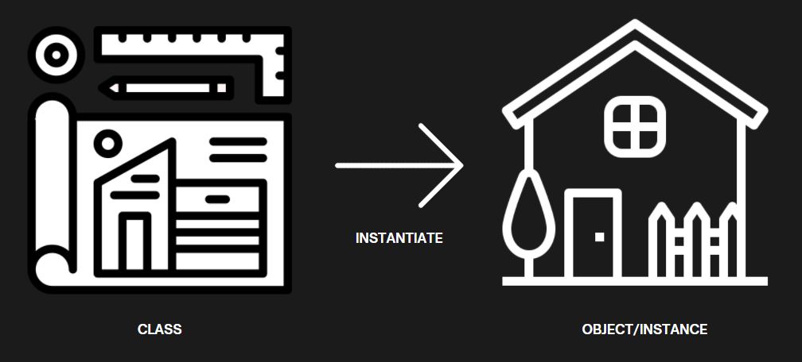
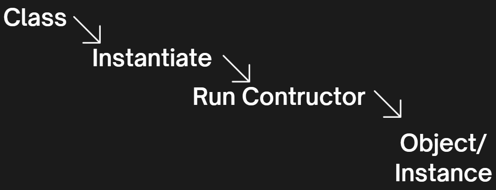

# OOP BASIC
Kita punya sebuah smartphone yang memiliki spesifikasi name,cpu, dan color

```js
let bambangSmartphone = {
  name : 'Iphul S20 Lite',
  cpu : 'Bionic 1660S',
  color : 'red'
}

let jcSmartphone = {
  name : 'Samsul 12 Pro Max',
  cpu : 'SnepDeragon 885',
  color : 'black'
}

let raditSmartphone = {
  name : 'Samsul 12 Pro Max Lite Super',
  cpu : 'SnepDeragon 890',
  color : 'violet'
}
```

Jika misalnya ada penambahan property didalam object maka kita harus menambahkan property baru ke semua object yang ada, dan juga sangat rentan terjadi kesalahan / typo.

## OOP (Object Oriented Programming)
Sebuah paradigma/model/konsep dalam pemograman yang mendefiniskan desain dari software dalam bentuk OBJECT 

### Why OOP?
- Flexibel dan mudah dimaintain
- Datanya bisa disembunyikan & gabisa diakses oleh kode eksternal
- Lebih mudah untuk didevelop dan lebih mudah untuk dimengerti
- Mudah untuk nambahin properti / data baru

### How to use it?
`CLASS` adalah sebuah blueprint/cetakan untuk membuat sebuah object instance

`INSTANSTIATE` adalah proses pembuatan object instance menggunakan class

`OBJECT INSTANCE` adalah object yang dihasil dari proses instanstiate menggunakan class

Penamaan class: 
- PascalCase
- Singular

Didalam OOP `VARIABLE` disebut juga dengan `PROPERTY` dan `FUNCTION` disebut juga dengan `METHOD`



Alur dari pembuatan sebuah object:

---
`CONSTRUCTOR`
- sebuah special method dalam class untuk mengisi value dari properti object instance
- constructor secara otomatis terpanggil pada saat proses instanstiate
- agar dinamis valuenya dari sebuah properti dalam object instance, manfaatkan parameter variabel

`INSTANCE METHOD`
- sebuah action dalam class yang bisa digunakan oleh object instance (ketika sudah terjadi proses instansiate)
- bisa akses properti object instance tersebut
- bisa dichaining

### DEMO OOP
```js
class Smartphone {
    constructor(name, cpu, color) {
        this.name = name
        this.cpu = cpu
        this.color = color
    }

    volumeUp() {
        console.log("lesgo super-shy, super-shy")
    }

    volumeDown() {
        console.log("brisik kali kau ah")
    }

    checkSpec() {
        console.log(`Type is ${this.name}`)
        console.log(`CPU is ${this.cpu}`)
        console.log(`Color is ${this.color}`)

        return this
    }
}   

let bambangSmartphone = new Smartphone("Iphul S20 Lite", "Bionic 1660S", "red")
let jcSmartphone = new Smartphone("Samsul 12 Pro Max", "SnepDeragon 885", "black")
let raditSmartphone = new Smartphone("Samsul 12 Pro Max Ultra Lite Super", "SnepDeragon 890", "violet")

console.log(bambangSmartphone)
bambangSmartphone.volumeDown()
bambangSmartphone.checkSpec().volumeUp()
```

# Reference:
- https://www.youtube.com/watch?v=4l3bTDlT6ZI&list=PL4cUxeGkcC9i5yvDkJgt60vNVWffpblB7&index=1&ab_channel=TheNetNinja
- https://developer.mozilla.org/en-US/docs/Web/JavaScript/Reference/Classes/
